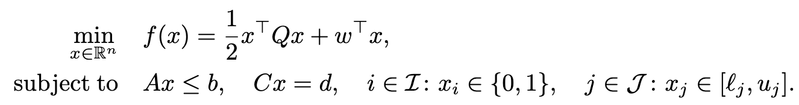

# QIHD for Mixed-Integer Quadratic Programming

QIHD (Quantum-Inspired Hamiltonian Descent) is a **quantum-inspired**, **GPU-enabled** algorithmic framework for solving mixed-integer quadratic programming (MIQP) problems.

## Problem formulation

MIQP is a classic optimization model characterized by a quadratic objective function defined over a feasible region with both continuous and binary variables:

## Installation 

## Usage

## Contact

## Contributors

## Citation
